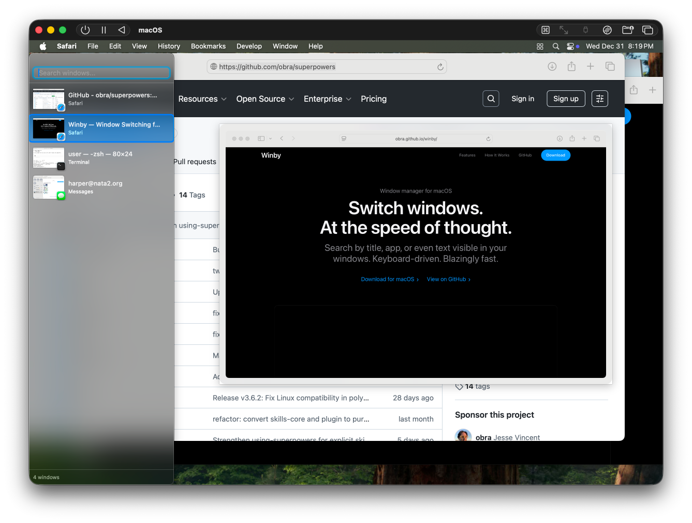

# Winby

A fast, keyboard-driven window switcher for macOS. Search by window title, app name, or even text visible inside your windows.



## Features

### Instant Search
Type to filter windows by title or application name. Fuzzy matching finds what you need even with partial or out-of-order characters.

### Live Window Previews
See thumbnails of every window before switching. The preview panel shows a larger view of the currently selected window so you know exactly where you're going.

### Content Search (OCR)
Search by text visible in your windows using optical character recognition. Find that terminal, document, or browser tab by what's actually displayed in it—not just the window title.

### Tab Support
Winby detects tabs in applications like Terminal, Safari, and others. Each tab appears as a separate entry in the window list, so you can jump directly to a specific tab.

### Keyboard-First Design
Navigate entirely with your keyboard:
- **Arrow keys**: Move through the window list
- **Return**: Switch to the selected window
- **Escape**: Dismiss Winby
- **Type**: Filter the window list

### Customizable Hotkey
Set any keyboard shortcut to activate Winby. The default is `⌘⇧Space`, but you can configure it to `⌘Tab` to replace the system app switcher entirely.

### Launch at Login
Start Winby automatically when you log in. It lives quietly in your menu bar until you need it.

## Installation

### Download
Download the latest release from the [Releases page](https://github.com/obra/winby/releases/latest).

1. Download `Winby-x.x.x.dmg`
2. Open the DMG and drag Winby to your Applications folder
3. Launch Winby from Applications
4. Complete the onboarding wizard to grant permissions and configure your hotkey

### Build from Source
Requires Xcode 16+ and macOS 14.0+.

```bash
git clone https://github.com/obra/winby.git
cd winby
swift build --configuration release
```

The built executable will be at `.build/release/Winby`.

To create an app bundle for distribution, see the GitHub Actions workflow in `.github/workflows/build-and-release.yml`.

## Usage

### Basic Workflow

1. **Press your hotkey** (default: `⌘⇧Space`) to open Winby
2. **Type to search** or use arrow keys to browse
3. **Press Return** to switch to the selected window
4. **Press Escape** to dismiss without switching

### Search Tips

- **Fuzzy matching**: Type `mai` to match "main.swift" or "Mail"
- **Multiple terms**: Type `term proj` to find a Terminal window with "proj" in the path
- **Content search**: If enabled, Winby searches text visible in windows, not just titles

### Menu Bar

Click the Winby icon in the menu bar to access:
- **Preferences**: Configure hotkey, launch at login, debug mode
- **Check for Updates**: Winby uses Sparkle for automatic updates
- **Quit**: Exit the application

### Preferences

Open Preferences from the menu bar icon or press `⌘,` when the Winby window is focused.

- **Activation Shortcut**: Click the recorder and press your desired key combination
- **Launch at Login**: Start Winby automatically when you log in
- **Debug Mode**: Enable logging to `/tmp/wm_debug.log` for troubleshooting

## Permissions

Winby requires two macOS permissions to function:

### Accessibility
**Required.** Winby uses the Accessibility API to:
- List windows from all applications
- Read window titles and positions
- Switch focus between windows
- Detect and switch browser/terminal tabs

Grant this in **System Settings → Privacy & Security → Accessibility**.

### Screen Recording
**Required.** Winby uses Screen Recording permission to:
- Capture window thumbnails for previews
- Perform OCR on window content for search

Grant this in **System Settings → Privacy & Security → Screen Recording**.

Without these permissions, Winby cannot function. The onboarding wizard guides you through granting both.

## How It Works

### Window Discovery
Winby uses the macOS `CGWindowListCopyWindowInfo` API to enumerate all on-screen windows. For each window, it retrieves:
- Window ID and owner PID
- Window title and bounds
- Layer and visibility information

### Tab Detection
For applications with tabs (Terminal, Safari, etc.), Winby uses the Accessibility API to enumerate tab elements within windows. Each tab appears as a separate entry in the window list with its own title.

### Window Switching
Winby uses private macOS APIs from the SkyLight framework to:
- Bring windows to the front (`SLSOrderWindow`)
- Focus specific windows (`_SLPSSetFrontProcessWithOptions`)
- Handle the `⌘Tab` hotkey override when configured

### Content Search
When you type in the search field, Winby:
1. Captures a screenshot of each visible window using ScreenCaptureKit
2. Runs Apple's Vision framework OCR on the screenshot
3. Caches the recognized text for fast subsequent searches
4. Matches your query against both window titles and OCR content

### Thumbnail Generation
Window thumbnails are captured using `CGWindowListCreateImage` for on-screen windows. Thumbnails are cached and updated periodically.

## System Requirements

- **macOS 14.0 (Sonoma)** or later
- **Apple Silicon or Intel** Mac

## Privacy

Winby runs entirely locally. It does not:
- Send any data to external servers (except Sparkle update checks to GitHub)
- Store window content persistently
- Access any data beyond what's needed for window switching

OCR results and thumbnails are cached in memory only and cleared when windows close or the app quits.

## Automatic Updates

Winby uses [Sparkle](https://sparkle-project.org/) for automatic updates. When a new version is available, you'll be prompted to update. Updates are signed and notarized by Apple.

You can check for updates manually from the menu bar: **Winby → Check for Updates**.

## Troubleshooting

### Winby doesn't appear when I press the hotkey
1. Check that Winby is running (look for the icon in the menu bar)
2. Verify Accessibility permission is granted in System Settings
3. Try setting a different hotkey in Preferences
4. Enable Debug Mode and check `/tmp/wm_debug.log`

### Window previews are blank or missing
1. Verify Screen Recording permission is granted
2. Some windows (e.g., DRM-protected content) cannot be captured
3. Minimized windows may not have thumbnails

### Content search doesn't find text in my windows
1. Verify Screen Recording permission is granted
2. OCR works best on clearly rendered text
3. Text in images or unusual fonts may not be recognized
4. Content is indexed when windows are visible; background windows use cached content

### The app crashes on launch
1. Ensure you're running macOS 14.0 or later
2. Try deleting preferences: `defaults delete com.winby.app`
3. Check Console.app for crash logs

### ⌘Tab override doesn't work
When using `⌘Tab` as your hotkey:
1. Winby must have Accessibility permission
2. The system may require you to re-grant permission after changing the hotkey
3. Some applications may intercept `⌘Tab` before Winby can handle it

## Configuration Files

Winby stores preferences in the standard macOS user defaults system:

```bash
# View all preferences
defaults read com.winby.app

# Reset to defaults
defaults delete com.winby.app

# Reset onboarding (will show setup wizard again)
defaults delete com.winby.app hasCompletedOnboarding
```

## Debug Mode

Enable Debug Mode in Preferences to log detailed information to `/tmp/wm_debug.log`:

```bash
# Watch the log in real-time
tail -f /tmp/wm_debug.log

# Clear the log
rm /tmp/wm_debug.log
```

Debug mode logs:
- Hotkey registration and events
- Window enumeration results
- Tab detection attempts
- OCR processing times
- Window switching operations

## Building

### Requirements
- Xcode 16.0 or later
- Swift 6.0 or later
- macOS 14.0 SDK

### Dependencies
Winby uses Swift Package Manager with two dependencies:
- [KeyboardShortcuts](https://github.com/sindresorhus/KeyboardShortcuts) - Global hotkey handling
- [Sparkle](https://github.com/sparkle-project/Sparkle) - Automatic updates

### Build Commands

```bash
# Debug build
swift build

# Release build
swift build --configuration release

# Run tests (if any)
swift test

# Clean build artifacts
swift package clean
```

### Creating a Release

Releases are created automatically via GitHub Actions when a version tag is pushed:

```bash
git tag v1.0.0
git push origin v1.0.0
```

The workflow will:
1. Build the release binary
2. Create a signed app bundle
3. Sign with Developer ID
4. Notarize with Apple
5. Create a DMG installer
6. Generate Sparkle appcast
7. Create a GitHub Release with the DMG

## Architecture

Winby is a single-file Swift application (`Sources/main.swift`) structured as:

- **AppConfig**: User preferences and permission helpers
- **WindowManager**: Window enumeration, caching, and switching logic
- **WindowInfo**: Data structure for window metadata
- **SidebarView**: Main SwiftUI interface with search and window list
- **SettingsView**: Preferences panel
- **OnboardingView**: First-run setup wizard
- **AppDelegate**: Application lifecycle, hotkey handling, window management

The app uses:
- **SwiftUI** for the interface
- **AppKit** for window management and menu bar
- **ScreenCaptureKit** for thumbnails and OCR capture
- **Vision** framework for OCR
- **Private SkyLight APIs** for advanced window operations

## Contributing

Contributions are welcome! Please:

1. Fork the repository
2. Create a feature branch
3. Make your changes
4. Test thoroughly on macOS 14.0+
5. Submit a pull request

For bugs, please open an issue with:
- macOS version
- Steps to reproduce
- Debug log output (if applicable)

## License

MIT License. See [LICENSE](LICENSE) for details.

## Credits

Created by [Jesse Vincent](https://github.com/obra).

Built with:
- [KeyboardShortcuts](https://github.com/sindresorhus/KeyboardShortcuts) by Sindre Sorhus
- [Sparkle](https://sparkle-project.org/) by the Sparkle Project

---

**[Download Winby](https://github.com/obra/winby/releases/latest)** · **[View Source](https://github.com/obra/winby)** · **[Report Issue](https://github.com/obra/winby/issues)**
